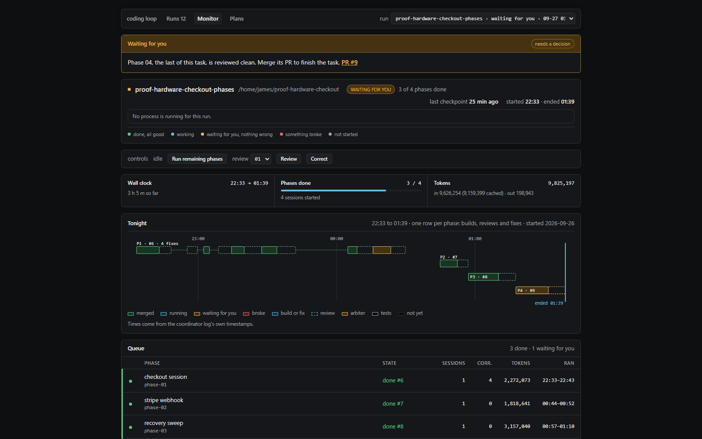
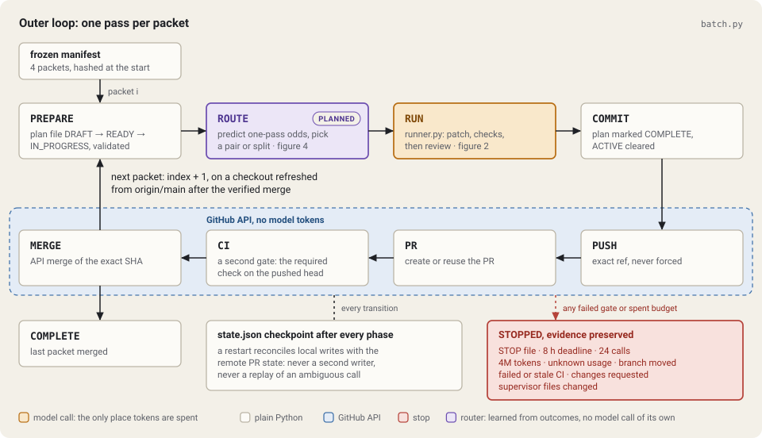
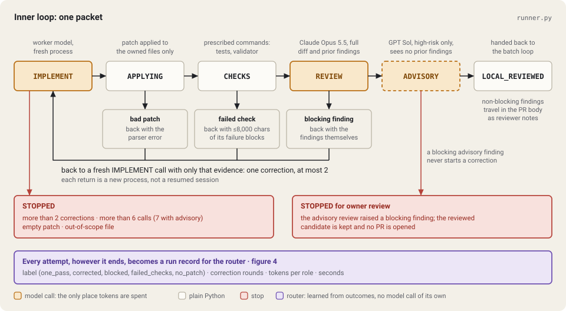
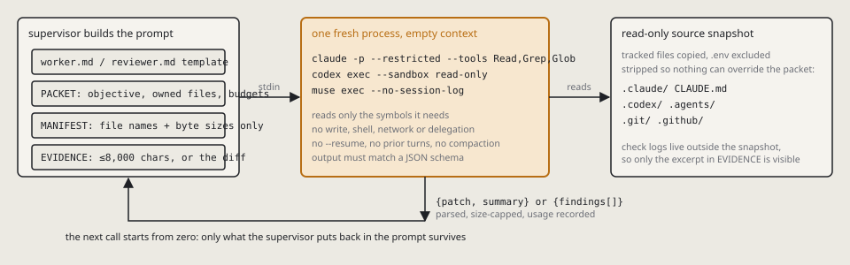

# coding-loop

An unattended coding loop that turns a queue of frozen task packets into merged pull requests. Every model call is a fresh process with an empty context. Ordinary Python does everything else: applying patches, running checks, committing, pushing, opening PRs, polling CI, merging, checkpointing and resuming.



The browser monitor makes the supervisor's evidence legible while it runs: budgets, model calls,
checks, reviews, corrections, pull requests and the exact point where an owner is needed. It can
watch both packet batches and the lighter phase runner from one page.

It was built to run overnight against a private Django repo (a one-person inventory and eBay selling system) with GPT and Claude taking turns as worker and reviewer. The code here is lifted from that repo's `scripts/coordination/` unchanged, plus its tests, so you can read a real thing rather than a sketch.

Amber in the diagrams is the only place model tokens are spent.

## 1. Outer loop: one pass per packet (`batch.py`)



Each packet is a full trip along the top row. `PREPARE` writes and validates the packet's plan file, `RUN` hands off to the inner loop, and everything from `PUSH` onwards is plain HTTP against the GitHub API. The next packet starts from a refreshed `origin/main` after the previous one has verifiably merged. A `state.json` checkpoint is written after every phase, so a restart reconciles local writes and remote PR state instead of starting a second writer.

Anything in red stops the queue in place with the evidence preserved: a `STOP` file, the wall-clock deadline, the call or token budget, failed or stale CI, a changes-requested review, a moved branch, or a change to the supervisor's own files while it is running.

## 2. Inner loop: one packet (`runner.py`)



The worker model is asked for a unified diff and a summary, nothing else. The supervisor applies the patch to the packet's owned files only, runs the prescribed check commands, then sends the full diff to a reviewer model. Three things send work back to a fresh `IMPLEMENT` call, each with a bounded slice of evidence:

- a patch that does not apply, with the parser error;
- a failed check, with at most 8,000 characters of the failure blocks from its log;
- a blocking review finding, with the findings themselves.

A corrected candidate is reviewed against the findings it was meant to fix, so the reviewer converges instead of raising new nits each round. Non-blocking findings travel into the PR body as reviewer notes and never cost a correction. High-risk packets get a second, independent advisory review from a different model family whose blocking finding stops the run for the owner rather than triggering a fix.

## 3. What one model call can see



Context is managed between calls, not inside them. The supervisor assembles the prompt from a role template, the packet, a manifest of owned file names and sizes, and bounded evidence. The process then runs with read-only tools over a source snapshot from which `.claude/`, `CLAUDE.md`, `.codex/`, `.agents/` and `.env*` have been stripped, so nothing in the repo can override the packet. It returns JSON matching a schema. The next call starts from zero.

## Budgets

| Limit | Default | Scope |
| --- | --- | --- |
| Wall clock | 8 h | whole batch |
| Model calls | 24 | whole batch |
| Reported tokens | 4,000,000 | checked before each call, not a hard cap |
| Calls per packet | 6, or 7 with advisory review | one packet |
| Corrections per packet | 2 | one packet |
| CI wait | 1 h | one PR |
| Failure excerpt | 8,000 chars | one correction |

## Workers and reviewers

The worker model is set per packet. Three adapters exist:

| Adapter | Command | Notes |
| --- | --- | --- |
| Codex | `codex exec --sandbox read-only --output-schema …` | runs inside an isolated runtime home with network disabled |
| Claude Code | `claude -p --restricted --tools Read,Grep,Glob --json-schema …` | also used for the reviewer role |
| Muse | `muse exec --json --output-schema … --no-session-log` | reports no token counts, so only the call budget bounds it |

The reviewer role is pinned in `runner.py` (`REVIEW_MODEL`). The advisory reviewer for high-risk packets is the Codex model at high effort.

## Layout

```
scripts/coordination/
  batch.py          outer loop: queue, commit, push, PR, CI gate, merge, resume
  runner.py         inner loop: worker call, patch apply, checks, review, corrections
  isolated.py       source snapshot and per-call runtime isolation
  github.py         the few GitHub API calls the supervisor makes
  checks.py         runs the repo's test labels against a dedicated Postgres
  configure.py      freezes an operator manifest from a queue file
  service.py        systemd start / status / stop wrapper
  recovery.py       reconciles a checkpoint after a crash
  export_reviews.py dumps reviewer calls as benchmark cases
  smoke.py          small live-model run against a synthetic fixture
  hooks.py          optional Claude Code hook profile for the worker process
  worker.md, reviewer.md, advisory.md, coordinator.md   role prompts
  ebay_queue.json   the real four-packet queue this shipped with
scripts/tests/      197 tests, no live models
scripts/validate_plans.py, PLANS.md, docs/plans/templates/
                    the plan lifecycle the batch loop drives (DRAFT → READY → IN_PROGRESS → COMPLETE)
examples/           a real smoke run with fault injection, plus starter packet, manifest and hook config
```

## Running the tests

```sh
python3 -m unittest discover -s scripts/tests -p 'test_*.py'
```

They stub every model CLI. A failing stub is put first on `PATH` so no test can reach a real model.

## Try the monitor without a model

The repository includes a recorded, synthetic smoke run. It contains no live repository or model
credentials, so it is the quickest way to see the UI:

```sh
git clone https://github.com/JA-Marshall/coding-loop.git
cd coding-loop
python3 scripts/monitor/serve.py --directory examples/smoke-run
```

Open `http://127.0.0.1:8790/`. The monitor uses only the Python standard library and binds to
loopback. Running real packets additionally needs Git, an authenticated GitHub CLI, and at least
one supported model CLI. The background batch service expects Linux with systemd; WSL works.

This is currently a working extraction, not a polished package. The monitor and phase runner take
project configuration at runtime, while the full batch path still contains the Storehouse-specific
queue, plan lifecycle, Django/PostgreSQL checks and required-check name described below.

## Running one packet

```sh
python3 -m scripts.coordination.runner examples/packet.json --directory /some/new/private/dir
```

The packet must name an absolute checkout, an exact 40-character base SHA, a `codex/` branch, the owned files, at least one check command, and the worker model. See `examples/packet.json` and the contract in `validate_packet` in `runner.py`. The run directory must be outside the checkout and must not already exist.

## Running a packet derived from a merged pull request

A merged pull request with tests can be posed as a task: reproduce the product change from the base commit, judged by the pull request's own tests. `derived.py` runs such a packet on a public repository that has no plan lifecycle.

```sh
python3 -m scripts.coordination.derived prepare packet.json --source /path/to/clone --directory /private/derived/some-pr
python3 -m scripts.coordination.derived validate --directory /private/derived/some-pr --python /path/to/env/bin/python
python3 -m scripts.coordination.derived run --directory /private/derived/some-pr --worker-model gpt-6.1-sol --worker-reasoning high --auth-home ~/.codex --live
```

`gpt-6.1-sol` needs Codex CLI 0.159.1 or later; an older client is refused that model on a ChatGPT sign-in.

- `prepare` clones at the base commit and saves the test files from the merge commit outside the checkout. The packet's `hidden_overlay` names that directory. The runner places those files over the checkout only while a check command runs and puts back what was there before the candidate is fingerprinted, reviewed or read by a model.
- `validate` makes no model call. The checks must fail at the base commit and pass once the merged change to the owned files is applied; a packet that does neither cannot judge an attempt. `--python` is an interpreter that already holds the repository's test dependencies for that base commit, and it replaces a leading `python` in each check command.
- `run` makes one attempt in a fresh checkout under `attempts/`: one worker and the primary reviewer, with triage and the advisory review off. Every model call reads an isolated source snapshot without Git history, so the merged change cannot be read from the clone.

A worker model whose name starts with `muse-` runs through Meta's Muse Code CLI (`muse exec`), in the isolated adapter only. Muse's file tools are not confined to its workspace: in a probe on 2026-09-30, with writes, shell and web tools disabled, it read a file outside it. So the whole process runs inside `codex sandbox`, under a profile that can read the source snapshot and the binaries and write only a home of its own under `muse-N/` in the run directory. The same probe inside that sandbox could not read outside the snapshot, run a shell command or write a file. The network stays on, because the model is served remotely; the call has no shell and no web tool to use it with. That home gets a copy of the Muse login, removed when the call ends, and none of the owner's memories, rules or sessions. Token counts come from the session logs Muse writes there, its helper sessions included; the adapter runs the installed binary, not the launcher that updates itself.

The loop refuses a candidate that holds a symbolic link. A public repository may track some, so `prepare` and `run` leave the links the base commit tracks out of the working tree with a sparse checkout, and `prepare` lists them in `derived.json` as `omitted_symlinks`. `HEAD` is still the base commit and a link the worker adds is refused as before. The worker does not see those paths, and a check that needs one of them will fail validation.

When a check fails, the worker's correction is given an excerpt of the check log, as it is for any packet. For a derived packet that excerpt comes from the hidden tests, so a corrected attempt has seen part of them; a one-pass attempt has not.

## Running a batch

```sh
python3 -m scripts.coordination.configure --checkout /path/to/repo --output /private/batches/run-01/manifest.json
python3 -m scripts.coordination.service check /private/batches/run-01/manifest.json --directory /private/batches/run-01/run
python3 -m scripts.coordination.service start /private/batches/run-01/manifest.json --directory /private/batches/run-01/run
```

`configure.py` reads `ebay_queue.json` next to it, so replace that file with your own queue. Manifests are immutable once written. `service.py` runs the supervisor as a transient systemd unit so it survives the terminal closing.

## What is repo-specific

This was extracted, not generalised. Things you will want to change:

- `configure.py` hardcodes the repository slug, the three check commands and the queue file name.
- `checks.py` assumes a Django project and a dedicated PostgreSQL cluster on port 55442.
- `batch.py` writes plan files under `docs/plans/tasks/` in the lifecycle described by `PLANS.md` and validated by `scripts/validate_plans.py`. If your repo has no such lifecycle, `prepare` and the `COMMIT` phase are the places to simplify.
- `derived.py` assumes the target repository's tests run with an interpreter you prepared; it builds no environment.
- `keep-awake.ps1` is a Windows helper that stops the host sleeping while a run is live under WSL.

## Origin

Built on 26 September 2026 in a single Codex session with GPT-6 Astra, starting from the prompt "can you come up with a prompt to build the runner, or just start building it". Extended the same day in Claude Code to add Claude as primary reviewer, the independent advisory review, and the Muse worker.

## Watching it run

`scripts/monitor/` is a local control surface over the evidence directories: liveness, budgets, the
queue, each packet's checks, review and claim, and the reason a run stopped. Its evidence collector
does not modify source logs; the server binds loopback only and needs nothing but the standard
library and one HTML file. Explicit controls can write the loop's `STOP` file or a phase's
owner-decisions file, and can invoke the phase runner's bounded `run`, `review` and `correct`
commands.

```
python3 scripts/monitor/serve.py --directory ~/.local/share/storehouse-runner --directory ~/.local/share/proof-hardware-phases
```

Point `--directory` at one run, or at a folder of them, and repeat the flag for more trees; the
page lists every run it finds, newest first. It understands both the coding loop's checkpoints
and the phase runner's log (`scripts/phases/`). Its only writes are explicit operator actions: the
`STOP` file both loops honour, phase owner decisions, and launching the runner's own `run`,
`review` and `correct` commands. Its plan and mockup are in `docs/monitor/`.
